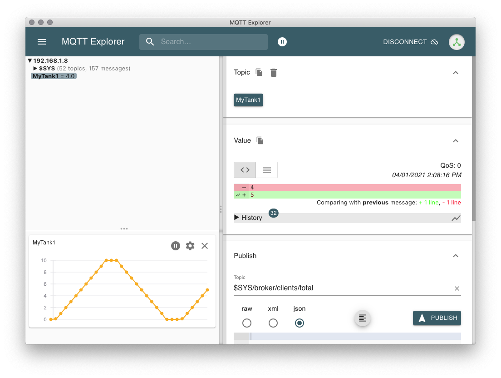

# Install
* Requires Python3
* Requires Paho-MQTT: `sudo pip3 install paho-mqtt`
* Modify line 8 to point to your MQTT Broker

# Simulator 
The simulator is intended to act like an independent process unit, emitting data over MQTT about its current state.

## Config
* Copy `config-example.py` to `config.py`
* Specify the MQTT section to match your Broker

## Run
`python3 simulate.py [simulation-file] [`*optional*` simulation-type] [`*optional*` topic-name]`
* **simulation-file**: name of simulation config file to use, no extension. eg: tank
* **simulation-type**: the kind of simulation to perform, defaults to stepwise
  * stepwise: publishes each line of the config in a loop with a delay
  * random: determines the lowest and highest number in the config and publishes a random number in that range in a loop with a delay
* **topic-name**: the MQTT topic to publish under, if left blank, uses the value of config

### Examples:
* `python3 simulate.py tank`
* `python3 simulate.py tank random MyTank1`

### Notes:
You can run multiple instances, but make sure they each have a unique topic on the Broker!

## Test
* Use an app like [MQTT Explorer](http://mqtt-explorer.com/), connect to the Broker, and watch the data come in

## Stop
`control + c`

# Gateway
The Gateway functions as a "connector" from MQTT to the SM Innovation Platform, pumping data from a simulator to the Platform.

## Config
* Uses same config.py as Simulator, but update the SMIP section to match your GraphQL Authenticator.
* Update line 16 to match the Attribute id to update in the SMIP
  * Hard-coding is sad. We need to query for and/or create the equipment instance, then find the attribute to update programmatically.

## Run
`python3 gateway.py`