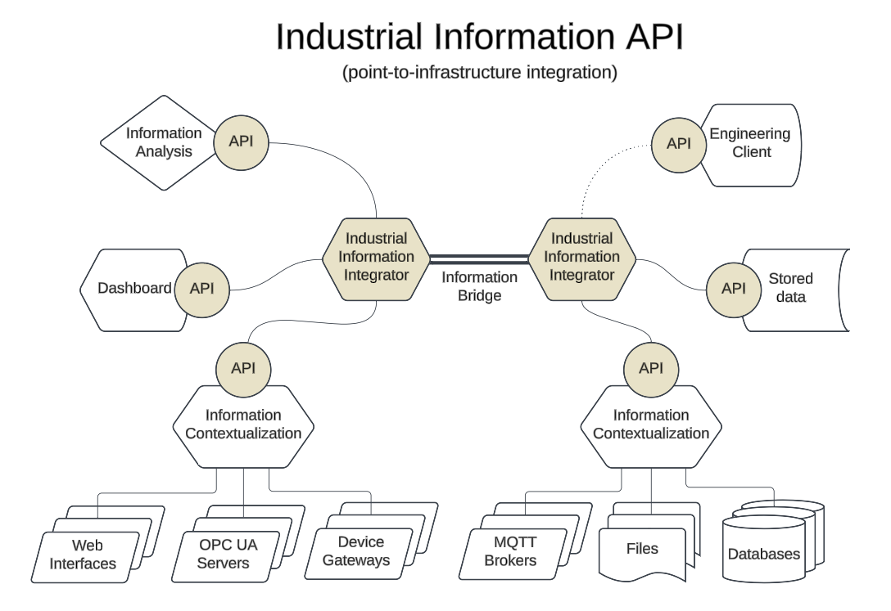
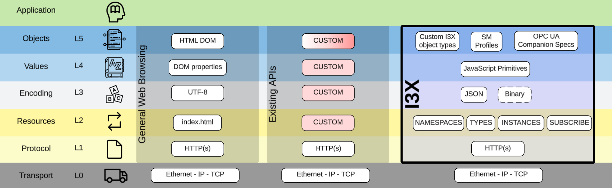

# API (RFC for the Future)

## Problem Statement
The manufacturing information ecosystem benefits from the contributions of many players, over multiple decades of technology evolution. While this diversity creates a lot of platform choice for manufacturers, it has the opposite effect on the creation of app value. Application developers must choose which platforms to build against, and therefore are forced to develop against proprietary API implementations with no hope of portability between them. Apps create information value by consuming and producting the data available in a platform, and rendering it in ways that are helpful to end users -- analytics, visualization, notification, machine learning... all of these need contextualized data, and all end up abstracted by an underlying platform (be it an Historian, MES, MOM, EMI, or broker or server).

## Proposed Solution
This initial proposal recommends the [creation of a common API](https://github.com/cesmii/API/blob/main/RFC%20for%20Contextualized%20Manufacturing%20Information%20API.md), consisting of a base set of server primitives that a wide array of platforms can implement to commoditize this access to data. Such a common API does not prevent platform vendors from differentiating on their capabilities, but it will encourage a proliferation of portable apps to help spur adoption of such platforms, and create a vibrant marketplace of apps bringing value to end-users. The analogies in other industries should be obvious: Apple and Android users benefit from common APIs for access to device and platform capabilities exposed to app developers that have led to App Stores full of creative, useful, and enjoyable app experiences. Those platform vendors have benefited, but more importantly, the user has benefited.

## Call to Action
The authors of this document seek your feedback on how to move toward common interfaces for common industrial information functionality. In this public stage, this document is offered RFC-style, not as a prescription, but as an invitation: please [review the RFC](https://github.com/cesmii/API/blob/main/RFC%20for%20Contextualized%20Manufacturing%20Information%20API.md), consider how you might use or implement it in the tools that you are familiar with, and provide us feedback on how we can improve it -- within the scope it defines.

The preferred feedback mechanism is to use [GitHub issues](https://github.com/cesmii/API/issues), where input can be tracked, discussed, and categorized as an improvement or a feature request. If you desire to provide feedback, but cannot use GitHub issues, please email us: rfc@cesmii.org

## Background
This proposal has been created by industry participants with experience developing or using manufacturing information platforms such as those provided by Rockwell Automation, OSI Pi, ThinkIQ, ThingWorx and HighByte, are deep users and often contributors to the ecosystems around OPC UA, Asset Administration Shell, MQTT and Sparkplug/B, and have more than 50 years of combined experience in designing, developing, implementing and using manufacturing information software. The document has also benefited from a private review stage, where it was shared with more than 60 members of [CESMII](https://www.cesmii.org) to gather their feedback. 

## API Usage
The block diagram below shows where the CM Information API is most applicable, namely within the realm of software applications running on top of operating systems on PCs or servers. Information being accessed through the API are assumed to have already been processed by contexualization functions to make it ready for consumption by other applications.

## API tech stack within the Data Access Model
The image below shows the tech stack for a general Web Browser compared to the CM Information API, from the perspective of The Data Access Model.  Refer to the article ["How all protocols fail at data access interoperabilty"](https://iebmedia.com/technology/iiot/how-all-protocols-fail-at-data-access-interoperability/) for more information regarding The Data Access Model.

# GraphQL API (Current)

The current API, based on GraphQL as implemented by ThinkIQ, is still available here: [https://github.com/cesmii/graphql-api](https://github.com/cesmii/graphql-api)
